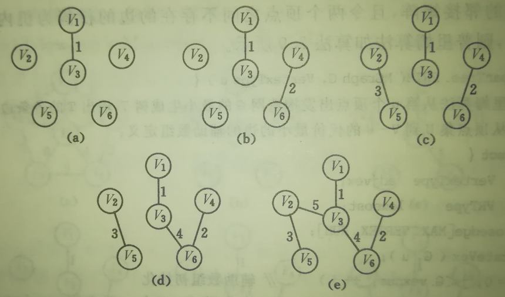

- Attention please: 

- **If you want to reprint my article, please mark the original address and author(刘书裴).**

- **If you are puzzled about a certain part or have some better suggestions, you can contact me: [3017218062@tju.edu.cn]()/[1005968086@qq.com]()**

- **If my blog has some mistakes, I'm so sorry!**

- **Thanks for watching!**

|   item   |   tool   |
| :------: | :------: |
|  image   | mspaint  |
| formula  |  LaTeX   |
| language |   C++    |
|   date   | 2020.9.6 |
|  author  |  刘书裴  |

# Directory

1.  [线性表](#1)
    1.  [顺序表](#1.1)
    2.  [链表](#1.2)
        1.  [单链表](#1.2.1)
        2.  [静态链表](#1.2.2)
        3.  [循环链表](#1.2.3)
        4.  [双向链表](#1.2.4)
    3.  [顺序表与链表的比较](#1.3)
2.  [栈和队列](#2)
    1.  [栈](#2.1)
    2.  [队列](#2.2)
    3.  [递归](#2.3)
3.  [字符串](#3)
4.  [数组与广义表](#4)
5.  [树与二叉树](#5)
    1.  [树的概念和基本术语](#5.1)
    2.  [二叉树](#5.2)
    3.  [二叉树的遍历](#5.3)
    4.  [二叉树的应用](#5.4)
    5.  [树与森林](#5.5)
    6.  [二叉树的计数](#5.6)
    7.  [霍夫曼树](#5.7)
6.  [图与搜索](#6)
    1.  [图的基本概念](#6.1)
    2.  [图的存储结构](#6.2)
        1.  [邻接矩阵](#6.2.1)
        2.  [邻接表](#6.2.2)
    3.  [图的遍历](#6.3)
    4.  [图的连通性问题](#6.4)
    5.  [最小生成树](#6.5)
    6.  [最短路径](#6.6)
    7.  [活动网络](#6.7)
7.  [查找](#7)
    1.  [静态查找表](#7.1)
    2.  [动态查找表](#7.2)
        1.  [二叉排序树](#7.2.1)
        2.  [二叉平衡树](#7.2.2)
        3.  [B树](#7.2.3)
        4.  [键树](#7.2.4)
    3.  [哈希表](#7.3)
8.  [排序](#8)
    1.  [插入排序](#8.1)
    	1.  [直接插入排序](#8.1.1)
    	2.  [折半插入排序](#8.1.2)
    	3.  [2-路插入排序](#8.1.3)
    	4.  [希尔排序](#8.1.4)
    2.  [快速排序](#8.2)
    	1.  [起泡排序](#8.2.1)
    	2.  [快速排序](#8.2.2)
    3.  [选择排序](#8.3)
    	1.  [直接选择排序](#8.3.1)
    	2.  [树形选择排序](#8.3.2)
    	3.  [堆排序](#8.3.3)
    4.  [归并排序](#8.4)
    5.  [基数排序](#8.5)
    6.  [排序方法总结](#8.6)

# 线性表<a id="1"/>

- 同一线性表中元素具有相同特性。
- 相邻数据元素之间存在序偶关系。
- 除第一个元素外，其他每一个元素有一个且仅有一个直接前驱。
- 除最后一个元素外，其他每一个元素有一个且仅有一个直接后继。

## 顺序表<a id="1.1"/>

- 定义：将线性表中的元素相继存放在一个**连续**的存储空间中。

- 存储结构：数组。

- 特点：线性表的顺序存储方式。

- 存取方式：顺序存取，随机存取。

## 链表<a id="1.2"/>

### 单链表<a id="1.2.1"/>

- 定义：用一组地址任意的存储单元存放线性表中的数据元素。

- 结构：每个元素由结点(Node)构成,	它包括两个域：数据域Data和指针域Link。


- 存储结构：链式存储结构。
- 特点：存储单元可以不连续。
- 存取方式：顺序存取。
- 类型定义

```c++
struct Node{
    int data;
    Node* link;
};
Node* head = new Node;
```

- 初始化

```c++
void Create(Node* head, int* initArray, int l){
    cout << "Create a array of size " << l << endl;
    Node* p, * t = head;
    for(int i = 0; i < l; i++){
        p = new Node;
        p->data = initArray[i];
        t->link = p;
        t = p;
    }
    t->link = nullptr;
}
```

- 增删改查

```c++
void Insert(Node* head, int value, int index){
    cout << "Insert " << value << " to index " << index << endl;
    if(index < 0){
        cout << "Index is invalid!" << endl;
        return;
    }
    Node* p, * t = head;
    while(t->link && index){
        t = t->link;
        index--;
    }
    if(index > 0){
        cout << "Index is invalid!" << endl;
        return;
    }
    p = new Node;
    p->data = value;
    p->link = t->link;
    t->link = p;
}

void Delete(Node* head, int index){
    cout << "Delete value of index " << index << endl;
    if(index < 0){
        cout << "Index is invalid!" << endl;
        return;
    }
    Node* p, * t = head;
    while(t->link && index){
        t = t->link;
        index--;
    }
    if(index > 0 || !t->link){
        cout << "Index is invalid!" << endl;
        return;
    }
    p = t->link;
    t->link = p->link;
    delete p;
}

void Update(Node* head, int value, int index){
    cout << "Update value of index " << index << endl;
    if(index < 0){
        cout << "Index is invalid!" << endl;
        return;
    }
    Node* p = head->link;
    while(p->link && index){
        p = p->link;
        index--;
    }
    if(index > 0){
        cout << "Index is invalid!" << endl;
        return;
    }
    p->data = value;
}

int Find(Node* head, int index){
    cout << "Find value of index " << index << endl;
    if(index < 0){
        cout << "Index is invalid!" << endl;
        return -1;
    }
    Node* p = head->link;
    while(p->link && index){
        p = p->link;
        index--;
    }
    if(index > 0){
        cout << "Index is invalid!" << endl;
        return -1;
    }
    return p->data;
}
```

- 长度

```c++
int Length(Node* head){
    int len = 0;
    Node* p = head;
    while(p->link){
        p = p->link;
        len++;
    }
    return len;
}
```

- 清空

```c++
void Clear(Node* head){
    cout << "Clear the array" << endl;
    Node* p;
    while(head->link){
        p = head->link;
        head->link = p->link;
        delete p;
    }
    head->link = nullptr;
}
```

### 静态链表 <a id="1.2.2"/>

- 用一维数组描述线性链表

### 循环链表<a id="1.2.3"/>

- 特点：最后一个结点的 link 指针不为NULL，而是指向头结点。只要已知表中某一结点的地址，就可搜寻所有结点的地址。
- 存储结构：链式存储结构。
- 约瑟夫问题：n 个人围成一个圆圈，首先第1个人从1开始一个人一个人顺时针报数,  报到第m个人，令其出列。然后再从下一个人开始，从1顺时针报数，报到第m个人，再令其出列，…，如此下去,  直到圆圈中只剩一个人为止。此人即为优胜者。


```c++
void Josephus(int n, int m){
    Node* head = new Node; // 头节点
    head->data = 1; // 赋值创建循环链表
    Node* p, * t = head;
    for(int i = 2; i <= n; i++){
        p = new Node;
        p->data = i;
        t->link = p;
        t = p;
    }
    t->link = head;

    t = head; // 从头节点开始
    for(int i = 1; i < n; i++){ // 依次删除n-1个节点
        for(int j = 0; j < m - 2; j++) // 移动m-2次，不用m-1是为了方便删除节点
            t = t->link;
        cout << i << ": " << t->link->data << endl;
        p = t->link; // 删除节点
        t->link = p->link;
        t = t->link; // 将下一个节点作为开始
        delete p;
    }
    cout << "result: " << t->data << endl;
}
```

### 双向链表<a id="1.2.4"/>

- 特点：在单链表的基础上，对每个节点添加了一个前驱指针。
- 结构：


- 类型定义

```c++
struct Node{
    int data;
    Node* prior, * next;
};
Node* head = new Node;
```

## 顺序表与链表的比较<a id="1.3"/>

- 基于空间的比较
  - 存储分配的方式
    - 顺序表的存储空间是静态分配的
    - 链表的存储空间是动态分配的
  - 存储密度 = 结点数据本身所占的存储量/结点结构所占的存储总量
    - 顺序表的存储密度 = 1
    - 链表的存储密度 < 1
- 基于时间的比较
  - 存取方式
    - 顺序表可以随机存取，也可以顺序存取
    - 链表是顺序存取的
  - 插入/删除时移动元素个数
    - 顺序表平均需要移动近一半元素
    - 链表不需要移动元素，只需要修改指针

# 栈和队列<a id="2"/>

## 栈<a id="2.1"/>

- 定义：是限定仅在表尾进行插入或删除操作的线性表。

  允许插入和删除的一端称为栈顶(top)，另一端称为栈底(bottom)。

- 特点：后进先出 (LIFO)。

- 类型定义

```c++
struct Node{
    int data;
    Node* link;
};

struct Stack{
    Node* top;
};
```

- 增删

```c++
void Push(Stack* s, int value){
    Node* p = new Node;
    p->data = value;
    p->link = s->top;
    s->top = p;
}

int Pop(Stack* s){
    Node* p = s->top;
    int value = p->data;
    s->top = p->link;
    delete p;
    return value;
}
```

- 其他

```c++
bool Empty(Stack* s){
    return s->top == nullptr;
}

int Top(Stack* s){
    return s->top->data;
}

void Clear(Stack* s){
    Node* p = s->top;
    while(p){
        s->top = p->link;
        delete p;
        p = s->top;
    }
}
```

- 数制转换：十进制数转换为八进制数。

```c++
struct Node{
    int data;
    Node* link;
};

struct Stack{
    Node* top;
};

void Push(Stack* s, int value){
    Node* p = new Node;
    p->data = value;
    p->link = s->top;
    s->top = p;
}

int Pop(Stack* s){
    Node* p = s->top;
    int value = p->data;
    s->top = p->link;
    delete p;
    return value;
}

void Conversion(int x, int y){
    Stack* s = new Stack;
    s->top = nullptr;

    while(x){ // N=(N/d)×d+N%d
        Push(s, x % y);
        x /= y;
    }
    while(s->top)
        cout << Pop(s);
    cout << endl;
}
```

- 行编辑程序：在用户输入一行的过程中，允许  用户输入出差错，并在发现有误时可以及时更正。设立一个输入缓冲区，用以接受用户输入的一行字符，然后逐行存入用户数据区; 并假设“#”为退格符，“@”为退行符。

```c++
struct Node{
    char data;
    Node* link;
};

struct Stack{
    Node* top;
};

void Push(Stack* s, char value){
    Node* p = new Node;
    p->data = value;
    p->link = s->top;
    s->top = p;
}

void Pop(Stack* s){
    Node* p = s->top;
    s->top = p->link;
    delete p;
}

void LineEdit(string line){
    Stack* s = new Stack;
    s->top = nullptr;
    for(char i: line){
        if(i == '#')
            Pop(s);
        else if(i == '@'){
            while(s->top->data != '\n')
                Pop(s);
        }
        else
            Push(s, i);
    }

    Stack* t = new Stack;
    t->top = nullptr;
    while(s->top){
        Push(t, s->top->data);
        s->top = s->top->link;
    }
    string newLine = "";
    while(t->top){
        newLine += t->top->data;
        t->top = t->top->link;
    }
    cout << newLine << endl;
}
```

- 迷宫求解
- 表达式求值

## 队列<a id="2.2"/>

- 定义：只允许在表的一端进行插入，而在另一端删除元素的线性表。在队列中，允许插入的一端叫队尾（rear），允许删除的一端称为对头(front)。
- 特点：先进先出 (FIFO)
- 链队列：链队列中，有两个分别指示队头和队尾的指针。链式队列在进队时无队满问题，但有队空问题。


- 类型定义

```c++
struct Node{
    char data;
    Node* link;
};

struct Queue{
    Node* head, * tail;
};
```

- 增删

```c++
void Push(Queue* q, int value){
    Node* p = new Node;
    p->data = value;
    p->link = nullptr;

    if(q->head == nullptr)
        q->head = q->tail = p;
    else{
        q->tail->link = p;
        q->tail = p;
    }
}

int Pop(Queue* q){
    if(q->head == nullptr)
        return -1;
    Node* p = q->head;
    int value = p->data;
    q->head = p->link;
    delete p;
    return value;
}
```

- 其他

```c++
bool Empty(Queue* q){
    return q->head == nullptr;
}

int Top(Queue* q){
    return q->head->data;
}

void Clear(Queue* q){
    Node* p = q->head;
    while(p){
        q->head = p->link;
        delete p;
        p = q->head;
    }
}
```

- 循环队列
  - 队头、队尾指针加1，可用取模(余数)运算实现。
  - 队头指针进1:  front = (front+1) %maxsize;
  - 队尾指针进1:  rear = (rear+1) % maxsize;
  - 队列初始化：front = rear = 0;
  - 队空条件：front == rear;
  - 队满条件：(rear+1) % maxsize == front;

## 递归<a id="2.3"/>

- 定义：若一个对象部分地包含它自己,  或用它自己给自己定义,  则称这个对象是递归的；	      若一个过程直接地或间接地调用自己，则称这个过程是递归的过程。
- 三种递归情况
  - 定义是递归的
  - 数据结构是递归的
  - 问题的解法是递归的
- 递归过程简洁、易编、易懂，递归过程效率低，重复计算多，改为非递归过程的目的是提高效率，单向递归和尾递归可直接用迭代实现其非递归过程，其他情形必须借助栈实现非递归过程。
- 阶乘函数	

```c++
int Factorial(int n){
    if(n == 0) return 1;
    return n * Factorial(n - 1);
}
```

- 斐波那契数列函数

  ```c++
  int Fib(int n){
      if(n <= 1) return n;
      return Fib(n - 1) + Fib(n - 2);
  }
  ```

- Ackerman函数

```c++
int Ackerman(int n, int m){
    if(n == 0 && m >= 0) return 1;
    if(n == 1 && m == 0) return 2;
    if(n >= 2 && m == 0) return n + 2;
    return Ackerman(Ackerman(n - 1, m), m - 1);
}
```

- 搜索链表最后一个结点并打印其数值

```c++
int Search(Node* head){
    if(head->link == nullptr) return head->data;
    return Search(head->link);
}
```

- 汉诺塔问题

```c++
void Hanoi(int n, char a, char b, char c){
    if(n == 1)
        cout << "move " << a << " to " << c << endl;
    else{
        Hanoi(n - 1, a, c, b);
        cout << "move " << a << " to " << c << endl;
        Hanoi(n - 1, b, a, c);
    }
}
```

- n皇后问题

```c++
const int num = 8; // 棋盘大小
int col[num]; // 列的标记
int md[num * 2 - 1]; // 主对角线的标记
int sd[num * 2 - 1]; // 副对角线的标记
int pos[num] = {-1}; // 摆放的位置
int solutions = 0; // 解法的数量

void Queen(int n, int i=0){
    for(int j = 0; j < n; j++){ // 遍历列
        if(!(col[j] || md[n + i - j - 1] || sd[i + j])){ // 检测冲突
            col[j] = md[n + i - j - 1] = sd[i + j] = 1; // 标记冲突
            pos[i] = j; // 标记位置
            if(i == n - 1){ // 一种解法结束
                solutions++; // 解法数+1
                for(int k: pos)
                    cout << k << ' ';
                cout << endl;
            }
            else Queen(n, i + 1); // 对下一行进行尝试
            col[j] = md[n + i - j - 1] = sd[i + j] = 0; // 取消标记进行下一列的尝试
            pos[i] = -1;
        }
    }
}
```

- 骑士问题
- 排列问题

```c++
void Permutation(int* array, int n, int m=0){
    if(n == m){ // 结束
        for(int i = 0; i < n; i++)
            cout << array[i] << ' ';
        cout << endl;
    }
    else{
        Permutation(array, n, m + 1); // 无变化的排列
        for(int i = m + 1; i < n; i++){ // 依次交换位置后的排列
            int temp = array[m];
            array[m] = array[i];
            array[i] = temp;
            Permutation(array, n, m + 1);
            temp = array[m];
            array[m] = array[i];
            array[i] = temp;
        }
    }
}
```

# 字符串<a id="3"/>

# 数组与广义表<a id="4"/>

# 树和二叉树<a id="5"/>

## 树的概念和基本术语<a id="5.1"/>

- 树是由n(n>=0)个结点的有限集合。如果n=0，称为空树；如果n>0，则有且仅有一个特定的称之为根(Root)的结点，它只有直接后继，但没有直接前驱；当n>1，除根以外的其它结点划分为m(m>0) 个互不相交的有限集 T1, T2 ,…, Tm，其中每个集合本身又是一棵树，并且称为根的子树(SubTree)。
- 基本术语
  - 结点：一个数据元素及指向其子树的分支。
  - 结点的度：结点拥有的子树个数。
  - 叶结点：度为零的结点。
  - 子女：结点子树的根。
  - 兄弟：同一结点子女。
  - 祖先：根到该结点路径上的所有结点。
  - 子孙：某结点为根的子树上的任意结点。
  - 结点层次：从根开始，根为第一层，根的子女为第二层，以此类推。
  - 树的深度（高度）：树中结点的最大层次数。
  - 有序树：树中结点的子树由左向右有序。
  - 森林：m(m>=0)棵互不相交的树。

## 二叉树<a id="5.2"/>

- 定义：一棵二叉树是结点的一个有限集合，该集合或者为空，或者是由一个根结点加上两棵分别称为左子树和右子树的、互不相交的二叉树组成。
- 特点：每个结点至多只有两棵子树（二叉树中不存在度大于2的结点）。
- 性质
  - 在二叉树的第i层上至多有2i-1个结点。(i>=1)
  - 深度为k的二叉树至多有2k-1个结点(k>=1)。
  - 对任何一棵二叉树T, 如果其叶结点数为n0, 度为2的结点数为n2,则n0=n2+1.
  - 具有n个结点的完全二叉树的深度为floor(log2(n))＋1
  - 如将一棵有n个结点的完全二叉树自顶向下，同一层自左向右连续给结点编号0, 1, 2, …,n-1，则有以下关系：
    - 若i=0, 则i无双亲

    - 若i>0, 则i的双亲为floor((i -1)/2)

    - 若2i+1<n, 则 i 的左子女为2i+1，若2*i+2 < n, 则 i 的右子女为2*i+2 
    - 若结点编号i为偶数，且i!=0,则左兄弟结点i-1.
    - 若结点编号i为奇数，且i!=n-1,则右兄弟结点为i+1.
    - 结点i 所在层次为floor(log2(i+1))+1
  - 含有n个结点的二叉链表中有n+1个空链域。
- 特殊形态的二叉树
  - 满二叉树：一棵深度为k且有2k-1个结点的二叉树称为满二叉树。
  - 完全二叉树：若设二叉树的高度为h，则共有h层。除第h层外，其它各层 (0~h-1) 的结点数都达到最大个数，第h层从右向左连续缺若干结点，这就是完全二叉树。
- 类型定义

```c++
struct Node{
    int data;
    Node* leftChild, * rightChild;
};
```

- 前序创建

```c++
void Create(Node* &t){
    int s;
	cin >> s;
	if(s == -1) t = nullptr;
	else{
        t = new Node;
		t->data = s;
		Create(t->leftChild);
		Create(t->rightChild);
	}
}
```

## 二叉树遍历<a id="5.3"/>

### 中序遍历 (Inorder Traversal)<a id="5.3.1"/>

```c++
void InOrder(Node* head){
    if(head){
        InOrder(head->leftChild);
        cout << head->data << endl;
        InOrder(head->rightChild);
    }
}

void InOrder(Node* t){
    stack<Node*> s;
    Node* p = t;
    while(p || !s.empty()){ // 节点不为null或栈不为空
        while(p){ // 不断将根节点和左节点入栈
            s.push(p);
            p = p->leftChild; // 访问左节点
        }
        if(!s.empty()){ // 栈不为空
            p = s.top(); // 取出栈顶
            s.pop();
            cout << p->data << ' '; // 中序遍历是在出栈后入栈前打印
            p = p->rightChild; // 访问右节点
        }
    }
}
```

### 前序遍历 (Preorder Traversal)<a id="5.3.2"/>

```c++
void PreOrder(Node* head){
    if(head){
        cout << head->data << endl;
        PreOrder(head->leftChild);
        PreOrder(head->rightChild);
    }
}

void PreOrder(Node* t){
    stack<Node*> s;
    Node* p = t;
    while(p || !s.empty()){ // 节点不为null或栈不为空
        while(p){ // 不断将根节点和左节点入栈
            cout << p->data << ' '; // 前序遍历是在入栈前打印
            s.push(p);
            p = p->leftChild; // 访问左节点
        }
        if(!s.empty()){ // 栈不为空
            p = s.top(); // 取出栈顶
            s.pop();
            p = p->rightChild; // 访问右节点
        }
    }
}
```

### 后序遍历 (Postorder Traversal)<a id="5.3.3"/>

```c++
void PostOrder(Node* head){
    if(head){
        PostOrder(head->leftChild);
        PostOrder(head->rightChild);
        cout << head->data << endl;
    }
}

void PostOrder(Node* t){ // 本质上是逆后序遍历，即交换左右节点
    stack<Node*> s1, s2;
    Node* p = t;
    while(p || !s1.empty()){ // 节点不为null或栈不为空
        while(p){ // 不断将根节点和右节点入栈
            s2.push(p); // 前序遍历是在入栈前打印
            s1.push(p);
            p = p->rightChild; // 访问右节点
        }
        if(!s1.empty()){ // 栈不为空
            p = s1.top(); // 取出栈顶
            s1.pop();
            p = p->leftChild; // 访问左节点
        }
    }
    while(!s2.empty()){ // 逆序输出
        cout << s2.top()->data << ' ';
        s2.pop();
    }
}
```

## 二叉树应用<a id="5.4"/>

- 节点数

```c++
int Count(Node* t){
    if(t == nullptr) return 0;
    return Count(t->leftChild) + Count(t->rightChild) + 1;
}
```

- 叶子数

```c++
int Leaves(Node* t){
    if(t == nullptr) return 0;
    if(t->leftChild == nullptr && t->rightChild == nullptr) return 1;
    return Leaves(t->leftChild) + Leaves(t->rightChild);
}
```

- 高度

```c++
int Height(Node* t){
    if(t == nullptr) return 0;
    int h1 = Height(t->leftChild);
    int h2 = Height(t->rightChild);
    return h1 > h2 ? h1 + 1 : h2 + 1;
}
```

- 复制

```c++
Node* Copy(Node* t){
    if(t == nullptr) return nullptr;
    Node* p = new Node;
    p->data = t->data;
    p->leftChild = Copy(t->leftChild);
    p->rightChild = Copy(t->rightChild);
    return p;
}
```

- 等价

```c++
bool Equal(Node* a, Node* b){
    if(a == nullptr && b == nullptr) return true;
    if(a && b && a->data == b->data && Equal(a->leftChild, b->leftChild) && Equal(a->rightChild, b->rightChild)) return true;
    return false;
}
```

## 树与森林<a id="5.5"/>

- 树的存储结构

  - 双亲表示：以一组连续空间存储树的结点，同时在结点中附设一个指针，存放双亲结点在链表中的位置。该方法利用每个结点只有一个双亲的特点，可以很方便求结点的双亲，但不方便求结点的孩子。

    

  - 孩子表示法(空链域n(d-1)+1个)

    - 等数量的链域

      

    - 孩子链表

      

  - 树的左子女-右兄弟表示(空链域n+1个)

    

- 森林与二叉树的转换

```c++
struct Node{
    int data;
    Node* firstChild, * nextSlbling;
};
```

- 深度优先遍历
  - 先根次序遍历：树的**先根遍历**结果与其对应二叉树表示的**前序遍历**结果相同，树的先根遍历可以借助对应二叉树的前序遍历算法实现。
  - 后根次序遍历：树的**后根遍历**结果与其对应二叉树表示的**中序遍历**结果相同，树的后根遍历可以借助对应二叉树的中序遍历算法实现

## 二叉树计数<a id="5.6"/>

- 由二叉树的前序序列和中序序列可唯一地确定一棵二叉树。

- 如果前序序列固定不变，给出不同的中序序列，可得到不同的二叉树。

- 具有 n 个结点的不同二叉树的棵数：Catalan数
  $$
  f(n)=\sum_{0}^{n-1}b_ib_{n-i-1}=\frac{1}{n+1}C_{2n}^{n}
  $$
  推导：

  根肯定会占用一个节点，那么剩余的n-1个节点可以有如下的分配方式，T(0,n-1)|T(1,n-2)|...T(n-1,0)，设T(i,j)表示根的左子树含i个结点，右子树含j个结点。将所有分配方式相加得catalan数。

## 霍夫曼树<a id="5.7"/>

- 路径长度（PL）
  - 两个结点之间的路径长度PL是连接两结点的路径上的分支数。
  - 树的外部路径长度是各叶结点(外结点)到根结点的路径长度之和EPL。
  - 树的内部路径长度是各非叶结点(内结点)到根结点的路径长度之和IPL。
  - 树的路径长度PL=EPL+IPL。
- 带权路径长度（WPL）：二叉树的带权 (外部) 路径长度是树的各叶结点所带的权值 wi 与该结点到根的路径长度 li 的乘积的和。
- 霍夫曼树：带权路径长度达到最小的二叉树即为霍夫曼树。
- 霍夫曼算法
  - 在 F 中选取两棵根结点的权值最小的扩充二叉树,    做为左、右子树构造一棵新的二叉树。置新的二叉树的根结点的权值为其左、右子树上根结点的权值之和。
  - 在 F 中删去这两棵二叉树。
  - 把新的二叉树加入 F。

```c++
struct Node{
    float weight;
    int parent, leftChild, rightChild; // 父母节点和子女节点，指向数组的索引
};

void Huffman(Node* tree, float* array, int n){
    int i, m = n * 2 - 1; // m为节点数
    for(i = 0; i < n; i++) // 初始化各节点权重
        tree[i].weight = array[i];
    for(i = 0; i < m; i++){ // 初始化各节点父母子女
        tree[i].parent = -1;
        tree[i].leftChild = -1;
        tree[i].rightChild = -1;
    }

    for(i = n; i < m; i++){ // 从n开始计算新节点
        float min1 = 1e9, min2 = 1e9; // 计算最小值和次小值
        int pos1, pos2; // 最小值和次小值位置
        for(int j = 0; j < i; j++){ // 遍历前面有值的节点
            Node p = tree[j];
            if(p.parent == -1){ // 该节点没父母
                if(p.weight < min1){ // 找最小值和次小值
                    pos2 = pos1; min2 = min1;
                    pos1 = j; min1 = p.weight;
                }
                else if(p.weight < min2){
                    pos2 = j; min2 = p.weight;
                }
            }
        }
        tree[i].leftChild = pos1; // 给该节点赋值子女
        tree[i].rightChild = pos2;
        tree[i].weight = tree[pos1].weight + tree[pos2].weight;
        tree[pos1].parent = tree[pos2].parent = i; // 给子女赋值父母
    }
}
```

# 图与搜索<a id="6"/>

## 图的基本概念<a id="6.1"/>

- 有向图与无向图：在有向图中，顶点对<x, y>是有序的。在无向图中，顶点对(x, y)是无序的。
- 完全图：若有 n 个顶点的无向图有 n(n-1)/2 条边，则此图为无向完全图。有 n 个顶点的有向图有n(n-1) 条边，则此图为有向完全图。
- 邻接顶点：如果 (u, v) 是 E(G) 中的一条边，则称 u 与 v 互为邻接顶点。
- 子图：设有两个图 G＝(V, E) 和 G‘＝(V’, E‘)。若 V’包含于V 且 E‘包含于E, 则称 图G’ 是 图G 的子图。
- 权：某些图的边具有与它相关的数, 称之为权。这种带权图叫做网络。
- 顶点的度：一个顶点v的度是与它相关联的边的条数。记作TD(v)。在有向图中, 顶点的度等于该顶点的入度与出度之和。
- 顶点 v 的入度是以 v 为终点的有向边的条数, 记作 ID(v)；顶点 v 的出度是以 v 为始点的有向边的条数, 记作 OD(v)。
- 路径：在图 G＝(V, E) 中, 若从顶点 vi 出发, 沿一些边经过一些顶点 vp1, vp2, …, vpm，到达顶点vj。则称顶点序列 (vi  vp1 vp2 ... vpm  vj) 为从顶点vi 到顶点 vj 的路径。它经过的边(vi, vp1)、(vp1, vp2)、...、(vpm, vj) 应是属于E的边。
- 路径长度：非带权图的路径长度是指此路径上边的条数。带权图的路径长度是指路径上各边的权之和。
- 简单路径：若路径上各顶点 v1,v2,...,vm 均不互相重复，则称这样的路径为简单路径。
- 简单回路：若路径上第一个顶点 v1 与最后一个顶点 vm 重合，则称这样的路径为回路或环。
- 连通图与连通分量：在无向图中，若从顶点v1到顶点v2有路径，则称顶点v1与v2是连通的。如果图中任意一对顶点都是连通的，则称此图是连通图。非连通图的极大连通子图叫做连通分量。

- 强连通图与强连通分量：在有向图中，若对于每一对顶点vi和vj，都存在一条从vi到vj和从vj到vi的路径，则称此图是强连通图。非强连通图的极大强连通子图叫做强连通分量。
- 生成树：假设一个连通图有n个顶点和e 条边，其中n-1条边和n个顶点构成一个极小连通子图，称该极小连通子图为此连通图的生成树。在极小连通子图中增加一条边，则一定有环。
  在极小连通子图中去掉一条边，则成为非连通图。

## 图的存储结构<a id="6.2"/>

### 邻接矩阵<a id="6.2.1"/>

- 在图的邻接矩阵表示中，有一个记录各个顶点信息的顶点表，还有一个表示各个顶点之间关系的邻接矩阵。
- 设图 A = (V, E)是一个有 n 个顶点的图，图的邻接矩阵是一个二维数组 A.edge，定义：


- 无向图的邻接矩阵是对称的；有向图的邻接矩阵可能是不对称的。
- 在有向图中，统计第 i 行 1 的个数可得顶点 i 的出度，统计第 j 列 1 的个数可得顶点 j 的入度。在无向图中, 统计第 i 行 (列) 1 的个数可得顶点i 的度。
- 网络的邻接矩阵


- 结构定义

```c++
const int N = 10;
const int E = 50;

struct Graph{
    int n, e; // 顶点数和边数
    char vertices[N]; // 顶点
    int edges[N][N]; // 二维矩阵
};
```

- 创建邻接矩阵

```c++
void Create(Graph* g, char* vertices, int* tails, int* heads, int* costs){
    for(int i = 0; i < g->n; i++)
        for(int j = 0; j < g->n; j++)
            (g->edge)[i][j] = 1e9;
    for(int i = 0; i < g->n; i++){
        (g->vertex)[i] = vertices[i];
        (g->edge)[i][i] = 0;
    }
    for(int i = 0; i < g->e; i++)
        (g->edge)[tails[i]][heads[i]] = (g->edge)[heads[i]][tails[i]] = costs[i];
}
```

### 邻接表<a id="6.2.2"/>

- 图的一种链式存储结构。
- 结构定义

```c++
const int N = 9;
const int E = 10;

struct Edge{
    int dest; // 边的目标顶点
    int cost; // 权重
    Edge* link; // 起始点的下一条边
};

struct Vertex{
    char data; // 顶点的值
    Edge* first; // 顶点的第一条边
};

struct Graph{
    int n, e; // 顶点数和边数
    Vertex list[N]; // 顶点数组
};
```

- 创建邻接表

```c++
void Create(Graph* g, char* vertices, int* tails, int* heads, int* costs){
    for(int i = 0; i < g->n; i++){ // 将所有顶点初始化
        (g->list)[i].data = vertices[i];
        (g->list)[i].first = nullptr;
    }
    Edge* p;
    int tail, head, cost;
    for(int i = 0; i < g->e; i++){ // 遍历所有边
        tail = tails[i]; head = heads[i]; cost = costs[i];

        p = new Edge; // 插入边到起始顶点后
        p->dest = head;
        p->cost = cost;
        p->link = (g->list)[tail].first;
        (g->list)[tail].first = p;

        p = new Edge; // 插入边到目标顶点后
        p->dest = tail;
        p->cost = cost;
        p->link = (g->list)[head].first;
        (g->list)[head].first = p;
    }
}
```

## 图的遍历<a id="6.3"/>

- DFS

```c++
int* visited = new int[N]{};

void DFS(Graph* g, int index=0){
    cout << index << ' '; // 输出顶点
    visited[index] = 1; // 标记
    Edge* p = (g->list)[index].first; // 遍历该顶点所有的边
    while(p){
        index = p->dest; // 获取目标顶点
        if(visited[index] == 0) // 若未访问
            DFS(g, index); // 继续访问
        p = p->link; // 下一条边
    }
}
```

- BFS

```c++
int* visited = new int[N]{};

void BFS(Graph* g, int index=0){
    Edge* p;
    queue<int> q;
    q.push(index); // 当前顶点入队列
    visited[index] = 1; // 标记
    while(!q.empty()){ // 不停访问直到队列为空
        index = q.front(); // 出队列
        q.pop();
        cout << index << ' '; // 输出顶点

        p = (g->list)[index].first; // 遍历该顶点所有边
        while(p){
            index = p->dest; // 获取目标顶点
            if(visited[index] == 0){ // 若未访问
                q.push(index); // 目标顶点入队列
                visited[index] = 1; // 标记
            }
            p = p->link; // 下一条边
        }
    }
}
```

## 图的连通性问题<a id="6.4"/>

- 求连通分量的算法需要对图的每一个顶点进行检测：若已被访问过，则该顶点一定是落在图中已求得的连通分量上；若还未被访问，则从该顶点出发遍历图，可求得图的另一个连通分量。
- 在无向连通图G中, 当且仅当删去G中的顶点v及所有依附于v的所有边后, 可将图分割成两个或两个以上的连通分量，则称顶点v为关节点。
- 没有关节点的连通图叫做重连通图。
- 深度优先生成树的根是关节点的充要条件是它至少有两个子女。

## 最小生成树<a id="6.5"/>

- 按照生成树的定义，n 个顶点的连通网络的生成树有 n 个顶点、n-1 条边。
- 构造最小生成树的准则
  - 必须使用且仅使用该网络中的n-1 条边来联结网络中的 n 个顶点；
  - 不能使用产生回路的边；
  - 各边上的权值的总和达到最小。
- Kruskal算法(加边法)

```
1. 把图中的所有边按代价从小到大排序(快排)； 
2. 把图中的n个顶点看成独立的n棵树组成的森林； 
3. 按权值从小到大选择边，所选的边连接的两个顶点，应属于两颗不同的树，则成为最小生成树的一条边，并将这两颗树合并作为一颗树；
4. 重复(3),直到所有顶点都在一颗树内或者有n-1条边为止。

O(eloge)
```



- Prim算法(加点法)

```
1. 图的所有顶点集合为V，初始令集合u={s},v=V−u；
2. 在两个集合u,v能够组成的边中，选择一条代价最小的边(u0,v0)，加入到最小生成树中，并把v0并入到集合u中；
3. 重复上述步骤，直到最小生成树有n-1条边或者n个顶点为止。

O(n^2)
```


## 最短路径<a id="6.6"/>

- Dijkstra算法（边上权值**非负**情形的**单源**最短路径问题）

```
定义集合S用于储存已求出的最短路径的点， 初始为空集；定义辅助数组dist，dist[i]表示起点到终点vi的最短路径的长度，其初态为：若v到vi有边存在，dist[i]=cost，否则无无穷大。结果用集合path保存。
1. 初始化：
S={v0}
dist[i]=edge[0][i] i=1,2,3...n-1
2. 求出最短路径的长度：
dist[j]=min(dist[i]) i in V-S
S=S+{j}
3. 修改：
dist[i]=min(dist[i], dist[j]+edge[j][i]) for i in V-S
4. 判断：
if S==V: break
else: to 2

简单来说，如果(v0, vj)的最短路径经过vi，则(v0, vi)也是最短路径；显然，通过局部最优解能够得到全局最优解，即贪心。复杂度为O(n^2)。
```

```c++
void Dijkstra(Graph* g, int start){
    int n = g->n;
    int dist[n]; int S[n]; int path[n]; // dist用于保存当前最短路径，S用于保存已计算的顶点，path用于保存路径结果
    for(int i = 0; i < n; i++){ // 初始化
        dist[i] = (g->edge)[start][i]; // dist[i]用起点到该终点的长度（直接相连）
        S[i] = 0; // S置空
        if(i != start && dist[i] < 1e9) // 与起点直接相连的点路径指向起点
            path[i] = start;
        else // 起点和无直接边的点指向空
            path[i] = -1;
    }

    dist[start] = 0; S[start] = 1; // 起点入S
    for(int i = 1; i < n; i++){ // 对于其他n-1个点
        int dmin = 1e9, index = start; // dmin为最短路径，index为最近点的下标
        for(int j = 0; j < n; j++){ // 遍历V-S中所有点，找到距离S中的点最近的点
            if(!S[j] && dist[j] < dmin){ // 在V-S中且距离更小
                dmin = dist[j];
                index = j;
            }
        }
        S[index] = 1; // 该点入S

        for(int j = 0; j < n; j++){ // 遍历V-S中所有点，更新dist和path
            int d = dist[index] + (g->edge)[index][j]; // 找捷径
            if(!S[j] && d < dist[j]){
                dist[j] = d;
                path[j] = index;
            }
        }
    }

    for(int i = 0; i < n; i++){
        cout << endl;
        cout << "Distance: " << dist[i] << " Path: " << i;
        int pre = path[i];
        while(pre != -1){
            cout << " -> " << pre;
            pre = path[pre];
        }
    }
}
```

- Bellman和Ford算法（边上权值为**任意值**的**单源**最短路径问题）
- Floyd算法（**所有顶点**之间的最短路径）

## 活动网络<a id="6.7"/>

- 可以用有向图表示一个工程。在这种有向图中，用顶点表示活动，用有向边<Vi, Vj>表示活动Vi 必须先于活动Vj 进行。这种有向图叫做顶点表示活动的**AOV网络** (Activity  On Vertices)。

- 在AOV网络中不能出现有向回路,  即有向环。如果出现了有向环，则意味着某项活动应以自己作为先决条件。

- 拓扑排序

  - 输入AOV网络。令 n 为顶点个数。	
  - 在AOV网络中选一个没有直接前驱的顶点, 并输出之; 
  - 从图中删去该顶点, 同时删去所有它发出的有向边;
  - 重复以上 ②、③步, 直到
    - 全部顶点均已输出，拓扑有序序列形成，拓扑排序完成；或图中还有未输出的顶点, 但已跳出处理循环。说明图中还剩下一些顶点, 它们都有直接前驱。这时网络中必存在有向环。

- 如果在无有向环的带权有向图中, 用有向边表示一个工程中的活动 (Activity), 用边上权值表示活动持续时间 (Duration),  用顶点表示事件 (Event),  则这样的有向图叫做用边表示活动的网络, 简称 **AOE网络** ( Activity On Edges ) 。

- 完成整个工程所需的时间取决于从源点到汇点的最长路径长度, 即在这条路径上所有活动的持续时间之和。这条路径长度最长的路径就叫做关键路径(Critical Path)。

- 关键活动

  - 事件Vi 的最早可能开始时间Ve(i)
    是从源点V0 到顶点Vi 的最长路径长度。

  - 事件Vi 的最迟允许开始时间Vl[i]
    是在保证汇点Vn-1 在Ve[n-1] 时刻完成的前提下，事件Vi 的允许的最迟开始时间。

  - 活动ak 的最早可能开始时间 e[k]
    设活动ak 在边< Vi , Vj >上, 则e[k]是从源点V0到顶点Vi 的最长路径长度。因此，e[k] = Ve[i]。

  - 活动ak 的最迟允许开始时间 l[k] 

    l[k]是在不会引起时间延误的前提下, 该活动允许的最迟开始时间。

  - 时间余量 l[k] - e[k]
    表示活动 ak 的最早可能开始时间和最迟允许开始时间的时间余量。l[k] == e[k] 表示活动 ak  是没有时间余量的关键活动。

- 为找出关键活动, 需要求各个活动的 e[k] 与 l[k]，以判别是否 l[k] == e[k]。

- Ve和e需要正向求，Vl和l需要逆向求。

# 查找<a id="7"/>

## 静态查找表<a id="7.1"/>

- 顺序表：从表的一端开始逐个进行记录的关键字和给定值的比较。
- 有序表：折半查找。
- 索引顺序表：在建立顺序表的同时，建立一个索引项，包括两项：关键字项和指针项。索引表按关键字有序，表则为分块有序。
- 对比：

|  | 顺序查找 | 折半查找 | 分块查找 |
| :------: | :------: | :------: | :------: |
| ASL | 最大 | 最小 | 两者之间 |
| 表结构 | 有序表、无序表 | 有序表 | 分块有序表 |
| 存储结构 | 顺序存储结构、线性链表 | 顺序存储结构 | 顺序存储结构、线性链表 |

|  | 查找 | 插入 | 删除 |
| :------: | :------: | :------: | :------: |
| 无序顺序表 | O(n) | O(1) | O(1) |
| 无序线性链表 | O(n) | O(1) | O(1) |
| 有序顺序表 | O(logn) | O(n) | O(n) |
| 有序线性链表 | O(n) | O(1) | O(1) |

## 动态查找表<a id="7.2"/>

### 二叉排序树<a id="7.2.1"/>

- 左子树上所有结点的值均小于根结点的值，右子树上所有结点的值均大于根结点的值。
- 查找
  - 1）若给定值等于根结点的关键字，则查找成功；
  - 2）若给定值小于根结点的关键字，则继续在左子树上进行查找；
  - 3）若给定值大于根结点的关键字，则继续在右子树上进行查找。
- 插入：若二叉排序树为空树，则新插入的结点为新的根结点；否则，新插入的结点必为一个新的叶子结点，其插入位置由查找过程得到。
- 删除：和插入相反，删除在查找成功之后进行，并且要求在删除二叉排序树上某个结点之后，仍然保持二叉排序树的特性。
  - 被删除的结点是叶子；其双亲结点中相应指针域的值改为空。
  - 被删除的结点只有左子树或者只有右子树；其双亲结点的相应指针域的值改为 “指向被删除结点的左子树或右子树”。
  - 被删除的结点既有左子树，也有右子树。以其前驱替代之，然后再删除该前驱结点。

### 平衡二叉树<a id="7.2.2"/>

- 树中每个结点的左、右子树深度之差（平衡因子BF）的绝对值不大于1。

- 查找的时间复杂度为O(logn)

- 平衡旋转技术

  - 单向右旋平衡处理（LL型）

    

  - 单向左旋平衡处理（RR型）

    

  - 双向旋转：先使其子树左旋再整棵树右旋（LR型）

    

  - 双向旋转：先使其子树右旋再整棵树左旋（RL型）

    

- 平衡二叉树插入算法

  - 若是空树，插入节点作为根节点，树深度加1
  - 插入节点key值等于根节点key值，则不插入
  - 插入节点key值小于根节点key值，插入在左子树上，如果左子树深加1并且：
    若根节点平衡因子为-1，则改为0，树深不变
    - 若根节点平衡因子为0，则改为1，树深加1
    - 若根节点平衡因子为1,且其左子的平衡因子为1（左左），则单向右旋，旋转后根节
    - 点和其右子的平衡因子改为0，树深不变
    - 若根节点平衡因子为1,且其左子的平衡因子为-1（左右），则先左旋再右旋，旋转后根节点和其左子的平衡因子改为0，右子的平衡因子改为-1,树深不变
  - 插入节点key值大于根节点key值，插入在右子树上，方法类似第3步

- 代码实现

```c++
#define LH 1
#define EH 0
#define RH -1

struct Node{
    int data;
    Node* leftchild, * rightChild;
    int bf;
};

void RRotate(Node* &t){ // 将LC变为根节点，LCr变为P的左子树
    Node* lc = t->leftchild;
    t->leftchild = lc->rightChild;
    lc->rightChild = t;
    t = lc;
}

void LRotate(Node* &t){ // 将LC变为根节点，LCl变为P的右子树
    Node* rc = t->rightChild;
    t->rightChild = rc->leftchild;
    rc->leftchild = t;
    t = rc;
}

void LBalance(Node* &t){
    Node* lc = t->leftchild;
    switch(lc->bf){ // 判断左子树lc的平衡因子
    case LH: // LL型，右旋
        t->bf = lc->bf = EH; // 在单向右旋平衡处理后BF(B)由1变为0，BF(A)由2变为0
        RRotate(t); // t右旋处理
        break;
    case RH: //LR型，先左旋后右旋
        Node* rd = lc->rightChild;
        switch(rd->bf){ // 判断下一层右子树rd的平衡因子
        case LH: // 处理后t的平衡因子为0
            t->bf = EH;
            break;
        case EH:
            t->bf = lc->bf = EH;
            break;
        case RH:
            t->bf = EH;
            lc->bf = LH;
            break;
        }
        rd->bf = EH;
        LRotate(t->leftchild); // lc左旋处理，变为LL型
        RRotate(t); // t右旋处理
    }
}
```

### B树<a id="7.2.3"/>

- 一种平衡的多路查找树
- 一棵m阶的B树或为空树，或为满足下列特性的m叉树：
  - 树中每个节点至多有m棵子树
  - 若根结点不是叶子结点，则至少有两棵子树
  - 除根结点之外的所有非终端结点至少有m/2棵子树
  - 所有的非终端结点中包含下列信息数据(n,A0,K1,A1,K2,A2,…,Kn,An)其中Ki(i=1,…,n)为关键字，且Ki<Ki+1,(i=1,…,n-1)，Ai(i=0,…,n)为指向子树根节点的指针，且指针Ai-1所指子树中所有节点的关键字均小于Ki(i=1,…,n),An所指子树中所有节点的关键字均大于Kn,n(m/2-1)≤n≤m-1)为关键字的个数（或n+1为子树个数）。
  - 所有的叶子结点都出现在同一层次上，并且不带信息（空指针）。
- 查找：类似于二叉排序树，从根节点开始，依次比较，层层遍历得到结果。
- 插入：每次插入一个关键字不是在树中添加一个叶子节点，而是在查找的过程中找到叶子节点所在层的上一层（叶子节点是记录，上一层是关键字最后一层），在某个节点中添加一个关键字，若结点的关键字个数不超过m-1，则插入完成，否则产生节点的分裂。简单说来，按照查找的方式进行插入，若关键字数量超过限制，则分裂（对半分裂）。
- 删除：假设删除节点在最下层，删除后仍满足B树定义则删除结束，否则要进行合并节点的操作，合并可能自下向上层层进行。
- B+树：
  - **关键字个数和子树个数一样多**
  - **所有叶子结点中包含全部关键字信息及指向含这些关键字记录的指针，且叶子节点本身依关键字的大小自小而大顺序链接。**
  - **所有非终端结点可看成索引，节点中仅含有其子树中的最大（或最小）关键字。**
- B+树的查找可以从根节点开始，若非终端结点上的关键字等于给定值，并不终止，二是继续向下直到叶子节点（因为非终端结点中只包含关键字而不是整个记录）；也可以从最小关键字的叶子节点开始顺序查找。

### 键树<a id="7.2.4"/>

- 是一棵度≥2的树，树中每个结点不是包含一个或几个关键字，而是只含有组成关键字的符号。如数值中的每一位，单词中的每个字母。

## 哈希表<a id="7.3"/>

哈希查找：又叫散列查找，利用哈希函数进行查找的过程。基本思想：在记录的存储地址和它的关键字之间建立一个确定的对应关系；这样，不经过比较，一次存取就能得到所查元素的查找方法。

哈希函数只是一种映象，所以哈希函数的设定很灵活，只要使任何关键字的哈希函数值都落在表长允许的范围之内即可。冲突：key1!=key2，但H(key1)=H(key2)的现象。

一般来说，**只能尽量减少冲突而不能完全避免冲突**，这是因为通常关键字集合比较大，其元素包括所有可能的关键字，而地址集合的元素仅为哈希表中的地址值，如上例中城市和地区的可能出现值不下几百几千而地址集合的大小只有26，所以哈希函数是一个压缩映象，就不可避免产生冲突。在定义哈希表时既要定义好哈希函数又要给出处理冲突的方法。

- 直接定址法

哈希函数为关键字的线性函数：H(key) = key 或者 H(key) = a * key + b
此法仅适合于：地址集合的大小 = = 关键字集合的大小，其中a和b为常数

- 数字分析法

假设关键字集合中的每个关键字都是由 s 位数字组成 (u1, u2, …, us)，分析关键字集中的全体， 并从中提取分布均匀的若干位或它们的组合作为地址。

此方法适合于：能预先估计出全体关键字的每一位上各种数字出现的频度。（取频度高的）

- 平方取中法

以关键字的平方值的中间几位作为存储地址。求“关键字的平方值” 的目的是“扩大差别” ，同时平方值的中间各位又能受到整个关键字中各位的影响。
此方法适合于：关键字中的每一位都有某些数字重复出现频度很高的现象。

- 折叠法

将关键字分割成若干部分，然后取它们的叠加和为哈希地址。两种叠加处理的方法：
移位叠加：将分割后的几部分低位对齐相加
间界叠加：从一端沿分割界来回折送，然后对齐相加
此方法适合于：关键字的数字位数特别多。

- 除留余数法

设定哈希函数为：H(key) = key MOD p   ( p≤m )，其中， m为表长，p 为不大于 m 的素数或是不含 20 以下的质因子。

- 随机数法

设定哈希函数为：H(key) = Random(key)，其中，Random 为伪随机函数
此方法适合于：对长度不等的关键字构造哈希函数。

- 处理冲突

  - 开放定址法

    为产生冲突的地址 H(key) 求得一个地址序列： H0, H1, H2, …, Hs 1≤s≤m-1
    Hi = ( H(key) + di ) MOD m，其中： i=1, 2, …, s

    H(key)为哈希函数，m为哈希表长，di为增量序列，有下列三种取法：

    - 线性探测再散列：di = c*i   最简单的情况c=1
    - 二次探测再散列：di = 1^2, -1^2, 2^2, -2^2, …,
    - 随机探测再散列：di 是一组伪随机数列或者di=i×H2(key)
    - 产生的 Hi 均不相同，且所产生的s(m-1)个 Hi 值能覆盖哈希表中所有地址。则要求：
      ※ 平方探测时的表长 m 必为形如 4j+3 的素数（如: 7, 11, 19, 23, … 等）；
      ※ 随机探测时的 m 和 di 没有公因子。

  - 再哈希法

    构造若干个哈希函数，当发生冲突时，计算下一个哈希地址，直到冲突不再发生。

  - 链地址法

    将所有哈希地址相同的记录都链接在同一链表中。

- 哈希表的查找


- 哈希表查找的分析

  - 选用的哈希函数;

  -  选用的处理冲突的方法;

  -  哈希表饱和的程度，装载因子

    α=n/m 值的大小（n—表中填入的记录数，m—表的长度）

    线性探测再散列

    随机探测再散列

    链地址法

# 排序<a id="8"/>

- **排序**

将一个数据元素的任意序列，重新排列成一个按关键字有序的序列。 

- **数据表**

它是待排序数据对象的有限集合。

- **主关键字**

数据对象有多个属性域, 即多个数据成员组成, 其中有一个属性域可用来区分对象, 作为排序依据，称为关键字。也称为排序码。

- **排序方法的稳定性**

如果在对象序列中有两 个对象r[i]和r[j], 它们的排序码 k[i] == k[j] , 且在排序之前, 对象r[i]排在r[j]前面。如果在排序之后, 对象r[i]仍在对象r[j]的前面,  则称这个排序方法是稳定的, 否则称这个排序方法是不稳定的。

- **内排序与外排序**

内排序是指在排序期间数据对象全部存放在内存的排序；外排序是指在排序期间全部对象个数太多，不能同时存放在内存，必须根据排序过程的要求，不断在内、外存之间移动的排序。

- **排序的时间开销**

排序的时间开销是衡量算法好坏的最重要的标志。排序的时间开销可用算法执行中的数据比较次数与数据移动次数来衡量。

## 插入排序<a id="8.1"/>

每步将一个待排序的对象, 按其排序码大小,  插入到前面已经排好序的一组对象的适当位置上, 直到对象全部插入为止。（假设升序，举例为49、38、65、97、76、13、27、[49]）

### 直接插入排序<a id="8.1.1"/>

#### 1. 简单理解

从插入第二个元素开始，将插入元素与之前插入的元素进行比较，小于就交换，大于就进行下一个元素的插入，直到结束。

#### 2. 排序演示

49、38、65、97、76、13、27、[49]

- 插入49，无前置元素，得49
- 插入38，38<49，无前置元素，得38、49
- 插入65，65>49，停止，得38、49、65
- 插入97，97>65，停止，得38、49、65、97
- 插入76，65<76<97，停止，得38、49、65、76、97
- 插入13，13<38，无前置元素，得13、38、49、65、76、97
- 插入27，13<27<38，无前置元素，得13、27、38、49、65、76、97
- 插入[49]，49=[49]<65，停止，得13、27、38、49、[49]、65、76、97

#### 3. 代码实现

```c++
void InsertSort(int* ARRAY, int n){
    for(int i = 1; i < n; i++){ // 从第二个元素开始一次插入
        int temp = ARRAY[i]; // 记录插入值
        int j = i - 1; // 向前依次比较
        while(j >= 0 && ARRAY[j] > temp){ // 插入值小于前元素
            ARRAY[j + 1] = ARRAY[j]; // 交换
            j--; // 继续向前
        }
        ARRAY[j + 1] = temp; // 在最后的交换位置插入值
    }
}
```

#### 4. 算法分析

- 设待排序对象个数为n, 则该算法的主程序执行n-1趟。
- 排序码比较次数和对象移动次数与对象排序码的初始排列有关。
- 最好情况下,  排序前对象已按排序码从小到大有序,  每趟只需与前面有序对象序列的最后一个对象比较1次, 总的排序 码比较次数为n-1, 不需移动记录。直接插入排序的时间复杂度为O(n^2)。
- 最坏情况下,待排记录按关键字非递增有序排列（逆序）时，第i趟时第i+1个对象必须与前面i个对象都做排序码比较, 并且每做1次比较就要做1次数据移动。总比较次数为(n+2)(n-1)/2次，总移动次数为(n+4)(n-1)/2。
- 在平均情况下的排序码比较次数和对象移动次数约为n^2/4。因此，直接插入排序的时间复杂度为**O(n^2)**。
- 直接插入排序是一种**稳定**的排序方法。

### 折半插入排序<a id="8.1.2"/>

### 2-路插入排序<a id="8.1.3"/>

### 希尔排序（缩小增量排序）<a id="8.1.4"/>

#### 1. 简单理解

先将整个待排记录序列分割成为若干子序列分别进行直接插入排序，待整个序列中的记录基本有序时，再对全体记录进行一次直接插入排序。

首先取一个整数gap<n作为间隔,  将全部对象分为gap个子序列,  所有距离为gap的对象放在同一个子序列中,  在每一个子序列中分别施行直接插入排序。然后缩小间隔gap, 例如取gap=gap/2，重复上述的子序列划分和排序工作。直到最后取gap=1, 将所有对象放在同一个序列中排序为止。

#### 2. 排序演示

49、38、65、97、76、13、27、[49]

- 取gap=4：
  - 对49、76，排序得49、76
  - 对38、13，排序得13、38
  - 对65、27，排序得27、65
  - 对97、[49]，排序得[49]、97
  - 得49、13、27、[49]、76、38、65、97
- 取gap=2：
  - 对49、27、76、65，排序得27、49、65、76
  - 对13、[49]、38、97，排序得13、38、[49]、97
  - 得27、13、49、38、65、[49]、76、97
- 取gap=1：
  - 得13、27、38、49、[49]、65、76、97

#### 3. 代码实现

```c++
void InsertSort(int* ARRAY, int n, int d=1){
    for(int i = d; i < n; i++){
        int temp = ARRAY[i];
        int j = i - d;
        while(j >= 0 && ARRAY[j] > temp){
            ARRAY[j + d] = ARRAY[j];
            j -= d;
        }
        ARRAY[j + d] = temp;
    }
}

void ShellSort(int* ARRAY, int n){
	for(int i = n / 2; i > 0; i /= 2) // 初始gap取n/2，逐渐减小
        InsertSort(ARRAY, n, i); // 对每个子序列进行直接插入排序
}
```

#### 4. 算法分析

- 开始时gap的值较大, 子序列中的对象较少, 排序速度较快;  随着排序进展,  gap 值逐渐变小, 子序列中对象个数逐渐变多,  由于前面大多数对象已基本有序, 所以排序速度仍然很快。
- gap的取法有多种。 Shell提出取gap=n/2，gap=gap/2，直到gap=1。
  对特定的待排序对象序列，可以准确地估算排序码的比较次数和对象移动次数。
- 希尔排序所需的比较次数和移动次数约为**n^1.3**，当n趋于无穷时可减少到**n(log2n)^2**
- 希尔排序是一种**不稳定**的排序方法。

## 快速排序<a id="8.2"/>

两两比较待排序对象的排序码，如发生逆序(即排列顺序与排序后的次序正好相反)，则交换之，直到所有对象都排好序为止。

### 起泡排序<a id="8.2.1"/>

#### 1. 简单理解

对第一个到第n-1个元素，进行n-1次排序，每次排序过程中，从左到右，将相邻元素比较，逆序则交换，直到结束。

#### 2. 排序演示

49、38、65、97、76、13、27、[49]

- 第一次排序：
  - 38、49、65、97、76、13、27、[49]
  - 38、49、65、76、97、13、27、[49]
  - 38、49、65、76、13、97、27、[49]
  - 38、49、65、76、13、27、97、[49]
  - 38、49、65、76、13、27、[49]、97
- 第二次排序：
  - 38、49、65、13、76、27、[49]、97
  - 38、49、65、13、27、76、[49]、97
  - 38、49、65、13、27、[49]、76、97
- 第三次排序：
  - 38、49、13、65、27、[49]、76、97
  - 38、49、13、27、65、[49]、76、97
  - 38、49、13、27、[49]、65、76、97
- 第四次排序：
  - 38、13、49、27、[49]、65、76、97
  - 38、13、27、49、[49]、65、76、97
- 第五次排序：
  - 13、38、27、49、[49]、65、76、97
  - 13、27、38、49、[49]、65、76、97
  - 无交换，停止，得13、27、38、49、[49]、65、76、97

#### 3. 代码实现

```c++
void BubbleSort(int* ARRAY, int n){
    for(int i = 0; i < n - 1; i++){ // n-1次排序
        for(int j = 0; j < n - 1 - i; j++) // 依次比较相邻的元素
            if(ARRAY[j] > ARRAY[j + 1]){ // 逆序则交换
                int temp = ARRAY[j];
                ARRAY[j] = ARRAY[j + 1];
                ARRAY[j + 1] = temp;
            }
    }
}

void BubbleSortV2(int* ARRAY, int n){
    for(int i = 0; i < n - 1; i++){
        int flag = 1; // 第一次优化，设置标志位记录是否发生交换
        for(int j = 0; j < n - 1 - i; j++)
            if(ARRAY[j] > ARRAY[j + 1]){
                int temp = ARRAY[j];
                ARRAY[j] = ARRAY[j + 1];
                ARRAY[j + 1] = temp;
                flag = 0; // 第一次优化，发生交换
            }
        if(flag) break; // 第一次优化，若没有发生交换，则表示已有序
    }
}

void BubbleSortV3(int* ARRAY, int n){
    int pos = n - 1, exc = n - 1; // 第二次优化，设置标志位限制下次排序的范围和本次排序最后一次比较的位置
    for(int i = 0; i < n - 1; i++){
        int flag = 1;
        for(int j = 0; j < pos; j++)
            if(ARRAY[j] > ARRAY[j + 1]){
                int temp = ARRAY[j];
                ARRAY[j] = ARRAY[j + 1];
                ARRAY[j + 1] = temp;
                flag = 0;
                exc = j; // 第二次优化，改变标志位
            }
        pos = exc; // 第二次优化，设置下次排序的范围为本次排序的最后一次交换位
        if(flag) break;
    }
}
```

#### 4. 算法分析

- 最多做n-1趟起泡就能把所有对象排好序。

- 在对象的初始排列已经按排序码从小到大排好序时，此算法只执行一趟起泡，做n-1次排序码比较，不移动对象。这是最好的情形。

- 最坏的情形是算法执行n-1趟起泡,第i趟 (1<= i<= n) 做n-i次排序码比较, 执行n-i次对象交换。这样在最坏情形下总的排序码比较次数KCN和对象移动次数RMN为：
  $$
  KCN=\sum_{i=1}^{n-1}(n-i)=\frac{1}{2}n(n-1)\\
  RMN=3\sum_{i=1}^{n-1}(n-i)=\frac{3}{2}n(n-1)
  $$

- 起泡排序是一个**稳定**的排序方法。时间复杂度为**O(n^2)**。

### 快速排序<a id="8.2.2"/>

#### 1. 简单理解

任取待排序序列中的某个元素(例如取第一个元素) 作为基准, 按照该元素的大小,将整个序列划分为左右两个子序列，一个全大于等于该元素，一个全小于等于该元素。

然后分别对这两个子序列重复施行上述方法，直到所有的元素都排在相应位置上为止。

#### 2. 排序演示

49、38、65、97、76、13、27、[49]

- 以49为基准：
  - 左38、13、27、[49]，以38为基准：
    - 左13、27，以13为基准：
      - 左无
      - 右27
      - 得13、27
    - 右[49]
    - 得13、27、38、[49]
  - 右65、97、76，以65为基准：
    - 左无
    - 右97、76，以97为基准：
      - 左76
      - 右无
      - 得76、97
    - 得65、76、97
  - 得13、27、38、[49]、49、65、76、97

#### 3. 代码实现

```c++
int Partition(int* ARRAY, int left, int right) {
	int key = ARRAY[left]; // 取子序列第一个元素为基准
    while(left < right){ // 遍历子序列所有元素
        while(left < right && ARRAY[right] >= key) // 右边的大于等于基准
            right--; // 指针左移
        if(left < right) // 未遍历结束，则是右指针逆序
            ARRAY[left++] = ARRAY[right]; // 交换
        while(left < right && ARRAY[left] <= key) // 左边的小于等于基准
            left++; // 指针右移
        if(left < right) // 未遍历结束，则是左指针逆序
            ARRAY[right--] = ARRAY[left]; // 交换
    }
    ARRAY[left] = key; // 填充基准
    return left; // 返回基准位置
}

void QuickSort(int* ARRAY, int left, int right) {
	if(left < right){
        int p = Partition(ARRAY, left, right); // 划分为两部分
		QuickSort(ARRAY, left, p - 1); // 左边子序列排序
		QuickSort(ARRAY, p + 1, right); // 右边子序列排序
	}
}
```

#### 4. 算法分析

- 快速排序的趟数取决于递归树的高度。

- 如果每次划分对一个对象定位后，该对象的左侧子序列与右侧子序列的长度相同，则下一步将是对两个长度减半的子序列进行排序，这是最理想的情况。

- 在 n个元素的序列中,  对一个对象定位所需时间为O(n)。若设t(n)是对n个元素的序列进行排序所需的时间，而且每次对一个对象正确定位后，正好把序列划分为长度相等的两个子序列，此时，总的计算时间为：
  $$
  T(n)\leq cn+2T(n/2)\\
  \leq cn+2(cn/2+2T(n/4))=2cn+4T(n/4)\\
  \leq 2cn+4(cn/4+2T(n/8))=3cn+8T(n/8)\\
  ......\\
  \leq cn\log_2n+nT(1)=O(nlog_2n)
  $$

- 可以证明，函数quicksort的平均计算时间也是**O(nlog2n)**。实验结果表明：**就平均计算时间而言，快速排序是所有内排序方法中最好的一个。**

- 快速排序是递归的，需要有一个栈存放每层递归调用时的指针和参数。

- 最大递归调用层次数与递归树的高度一致,理想情况为 log2(n+1) 。因此，要求存储开销为 O(log2n)。

- 在最坏的情况, 即待排序对象序列已经按其排序码从小到大排好序的情况下, 其递归树成为单支树, 每次划分只得到一个比上一次少一个对象的子序列。总的排序码比较次数将达
  $$
  \sum_{i=1}^{n-1}(n-i)=\frac{1}{2}n(n-1)\approx\frac{n^2}{2}
  $$

- 快速排序是一种**不稳定**的排序方法。

## 选择排序<a id="8.3"/>

每一次在后面的待排序元素中选出排序码最小的元素。待到第n-2次作完，待排序记录只剩下1个，就不用再选了。

### 直接选择排序<a id="8.3.1"/>

#### 1. 简单理解

进行n-1次选择最值，直到选出前n-1个最值。

#### 2. 排序演示

49、38、65、97、76、13、27、[49]

- 第一次：**13**、38、65、97、76、**49**、27、[49]
- 第二次：13、**27**、65、97、76、49、**38**、[49]
- 第三次：13、27、**38**、97、76、49、**65**、[49]
- 第四次：13、27、38、**49**、76、**97**、65、[49]
- 第五次：13、27、38、49、**[49]**、97、65、**76**
- 第六次：13、27、38、49、[49]、**65**、**97**、76
- 第七次：13、27、38、49、[49]、65、**76**、**97**

#### 3. 代码实现

```c++
void SelectSort(int* ARRAY, int n){
    for(int i = 0; i < n - 1; i++){ // 选择n-1次最值
        int k = i; // 最值的下标
        for(int j = i + 1; j < n; j++) // 依次比较
            k = ARRAY[j] > ARRAY[k] ? k : j;
        if(k != i){ // 如果最值不在当前位置，交换
            int temp = ARRAY[k];
            ARRAY[k] = ARRAY[i];
            ARRAY[i] = temp;
        }
    }
}
```

#### 4. 算法分析

- 直接选择排序的排序码比较次数KCN与对象的初始排列无关。设整个待排序对象序列有n个对象,   则第i趟选择具有最小排序码对象所需的比较次数总是n-i-1次。总的排序码比较次数为
  $$
  KCN=\sum_{i=0}^{n-2}(n-i-1)=\frac{n(n-1)}{2}
  $$

- 对象的移动次数与对象序列的初始排列有关。当这组对象的初始状态是按其排序码从小到大有序的时候,  对象的移动次数RMN=0，达到最少。

- 最坏情况是每一趟都要进行交换，总的对象移动次数为RMN=3(n-1)。

- 直接选择排序是一种**不稳定**的排序方法。

### 树形选择排序<a id="8.3.2"/>

### 堆排序<a id="8.3.3"/>

#### 1. 简单理解

(1) Ri <= R2i+1且 Ri <= R2i+2 (小顶堆)

(2) Ri >= R2i+1且 Ri >= R2i+2 (大顶堆)

升序----使用大顶堆，降序----使用小顶堆。

大顶堆的特点：每个结点的值都大于或等于其左右孩子结点的值，我们把大顶堆构建完毕后根节点的值一定是最大的，然后把根节点和最后一个元素（也可以说最后一个节点）交换位置，那么末尾元素此时就是最大元素了。

根据初始输入数据，利用堆的调整算法形成初始堆;

通过一系列的对象交换和重新调整堆进行排序。


#### 2. 排序演示

49、38、65、97、76、13、27、[49]

- 建堆：97|76、65|[49]、49、13、27|38
- 互换97和38，建堆：76|[49]、65|38、49、13、27
- 互换76和27，建堆：65|[49]、27|38、49、13
- 互换65和13，建堆：[49]|49、27|38、13
- 互换[49]和13，建堆：49|38、27|13
- 互换49和13，建堆：38|13、27
- 互换38和27，建堆：27|13
- 互换13和27，建堆：13
- 得13、27、38、49、[49]、65、76、97

#### 3. 代码实现

```c++
void Adjust(int* ARRAY, int left, int right){
    int parent = ARRAY[left]; // 记录父节点的值
    for(int i = left * 2 + 1; i <= right; i = i * 2 + 1){ // i*2+1是第一个子节点
        if(i < right && ARRAY[i] < ARRAY[i + 1]) // i*2+2是第二个子节点
            i++; // 选择值最大的那个儿子
        if(parent >= ARRAY[i]) // 无需调整
            break;
        ARRAY[left] = ARRAY[i]; // 父子交换值
        left = i;
    }
    ARRAY[left] = parent;
}

void HeapSort(int* ARRAY, int n){
    int i, temp = 0;
    // 建堆
    for(i = n / 2 - 1; i >= 0; i--) // n/2-1为倒数第一个非叶子节点
        Adjust(ARRAY, i, n - 1); // 初始化调整
    // 调整
    for(i = n - 1; i > 0; i--){ // 对于每一个非根节点
        temp = ARRAY[i]; // 交换根节点和当前节点
        ARRAY[i] = ARRAY[0];
        ARRAY[0] = temp;
        Adjust(ARRAY, 0, i - 1); // 重新调整堆
    }
}
```

#### 4. 算法分析

- 堆排序的时间复杂性为**O(nlog2n)**。
- 该算法的附加存储主要是在第二个for循环中用来执行对象交换时所用的一个临时空间。因此，该算法的空间复杂性为O(1)。
- 堆排序是一个**不稳定**的排序方法。

## 归并排序<a id="8.4"/>

#### 1. 简单理解

先递归划分子问题，然后合并结果。把待排序列看成由两个有序的子序列，然后合并两个子序列，然后把子序列看成由两个有序序列。

快速排序和归并的区别就在于它正好和递归的排序反过来。快速排序先排序再递归细分，排序是从上到下的。归并排序先递归细分再排序，排序是从下到上的。

#### 2. 排序演示

49、38、65、97、76、13、27、[49]

- 递归划分后进行排序
- 得49|38|65|97|76|13|27|[49]
- 得38、49|65、97|13、76|27、[49]
- 得38、49、65、97|13、27、[49]、76
- 得13、27、38、49、[49]、65、76、97

#### 3. 代码实现

```c++
void Merge(int* ARRAY, int left, int mid, int right){
    int num = right - left + 1; // 子序列大小
    int* merged = new int[num]; // 申请额外空间

    int i = left, j = mid + 1, k = 0; // 设置左右子序列的起始指针
    while(i <= mid && j <= right) // 遍历左序列所有元素或右序列所有元素
        if(ARRAY[i] <= ARRAY[j]) // 比较后填入
            merged[k++] = ARRAY[i++];
        else
            merged[k++] = ARRAY[j++];
    while(i <= mid) // 填入未遍历完的元素
        merged[k++] = ARRAY[i++];
    while(j <= right)
        merged[k++] = ARRAY[j++];

    for(k = 0; k < num; k++) // 将合并后的元素赋值到原数组中
        ARRAY[k + left] = merged[k];
    delete []merged; // 释放内存
}

void MergeSort(int* ARRAY, int left, int right) {
	if(left < right){
		int mid = (left + right) / 2; // 序列均分
		MergeSort(ARRAY, left, mid); // 左边子序列排序
		MergeSort(ARRAY, mid + 1, right); // 右边子序列排序
		Merge(ARRAY, left, mid, right); // 合并左右子序列
	}
}
```

```c++
void Merge(int* ARRAY, int* merged, int left, int mid, int right) {
	int i = left, j = mid + 1, k = left; // 设置左右子序列的起始指针
	while(i <= mid && j <= right) // 遍历左序列所有元素或右序列所有元素
		if(ARRAY[i] <= ARRAY[j]) // 比较后填入
            merged[k++] = ARRAY[i++];
		else
            merged[k++] = ARRAY[j++];
    while(i <= mid) // 填入未遍历完的元素
        merged[k++] = ARRAY[i++];
    while(j <= right)
        merged[k++] = ARRAY[j++];
    while(left <= right){ // 将合并后的元素赋值到原数组中
        ARRAY[left] = merged[left];
        left++;
    }
}

void MergeSort(int* ARRAY, int* merged, int left, int right) {
	if (right > left) {
		int mid = (left + right) / 2; // 序列均分
		MergeSort(ARRAY, merged, left, mid); // 左边子序列排序
		MergeSort(ARRAY, merged, mid + 1, right); // 右边子序列排序
		Merge(ARRAY, merged, left, mid, right); // 合并左右子序列
	}
}
```

#### 4. 算法分析

- 算法总的时间复杂度为**O(nlog2n)**。
- 归并排序占用附加存储较多，需要另外一个与原待排序对象数组同样大小的**辅助数组**。这是这个算法的缺点。
- 归并排序是一个**稳定**的排序方法。

## 基数排序<a id="8.5"/>

#### 1. 简单理解

基于数据位数的一种排序算法，按照不同的位数分别排序，对于每个位数，使用一个桶来进行计数，按照计数和桶之间的大小关系进行排序，将所有位数排序后终止。

#### 2. 排序演示

49、38、65、97、76、13、27、[49]

- 第一次分配：13|65|76|97、27|38|49、[49]
- 第一次收集：13、65、76、97、27、38、49、[49]
- 第二次分配：13|27|38|49、[49]|65|76|97
- 第二次收集：13、27、38、49、[49]、65、76、97

#### 3. 代码实现

```c++
int NBit(int x, int n, int radix=10){
    return (x / n) % radix; // 计算当前n位的值
}

void RadixSort(int* ARRAY, int* bucket, int n, int radix=10){
    int i, j, MaxValue = 0, MaxBits = 1;
    for(i = 0; i < n; i++) // 求序列中的最大值
        MaxValue = ARRAY[i] > MaxValue ? ARRAY[i] : MaxValue;
    while(MaxValue >= radix){  // 求最大值的位数
        MaxBits++;
        MaxValue /= radix;
    }

    int counter[radix]; // 定义桶，数量为radix
    int temp = 1; // 用于去除低位
    for(i = 0; i < MaxBits; i++){ // 按每一位进行排序
        for(j = 0; j < radix; j++) // 桶置空
            counter[j] = 0;
        // 分配
        for(j = 0; j < n; j++) // 桶计数，将该位的值相同的元素放入同一个桶内
            counter[NBit(ARRAY[j], temp, radix)]++;
        for(j = 1; j < radix; j++) // 每个桶的大小按升序累加，用于辅助数组的索引
            counter[j] += counter[j - 1];
        // 收集
        for(j = n - 1; j >= 0; j--){ // 遍历序列
            int num = NBit(ARRAY[j], temp, radix); // 计算该位的值
            bucket[counter[num] - 1] = ARRAY[j]; // 将元素按照所在桶的位置填入辅助数组
            counter[num]--; // 桶大小减一
        }
        for(j = 0; j < n; j++) // 将收集后的序列赋值到原序列中
            ARRAY[j] = bucket[j];
        temp *= radix; // 提高位
    }
}
```

#### 4. 算法分析

- 设m为最大位数，时间复杂度为**O(m*n)**，空间复杂度为O(n)，**稳定**排序。

## 排序方法总结<a id="8.6"/>

| 算法 | 平均时间复杂度 | 最坏时间复杂度 | 空间复杂度 | 稳定性 | 测试50000数(ms) | 测试100000数(ms) |
| :---: | :---: | :---: | :---: | :---: | :---: | :---: |
| 直接插入排序 | O(n^2) | O(n^2) | O(1) | 是 | 1595 | 6260 |
| 希尔排序 | O(nlogn) | O(n^s) | O(1) | 否 | 10 | 22 |
| 冒泡排序 | O(n^2) | O(n^2) | O(1) | 是 | 6500 | 26500 |
| 快速排序 | O(nlogn) | O(n^2) | O(nlogn) | 否 | 9 | 15 |
| 直接选择排序 | O(n^2) | O(n^2) | O(1) | 否 | 2450 | 9615 |
| 堆排序 | O(nlogn) | O(nlogn) | O(1) | 否 | <10 | 20 |
| 归并排序 | O(nlogn) | O(nlogn) | O(n) | 是 | 7 | 18 |
| 基数排序 | O(n*m) | O(n*m) | O(m) | 是 | <5 | <10 |
